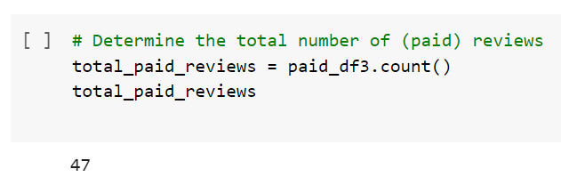
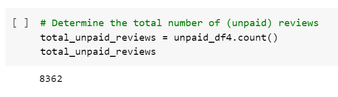
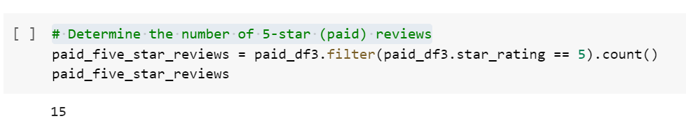
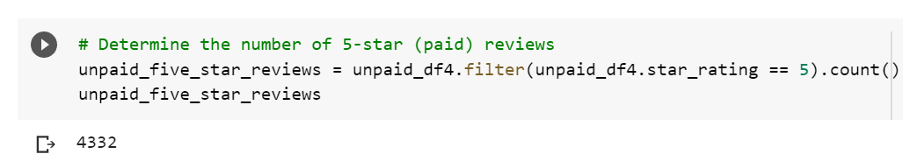
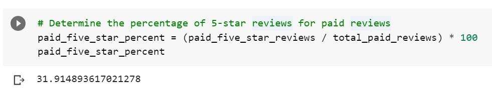
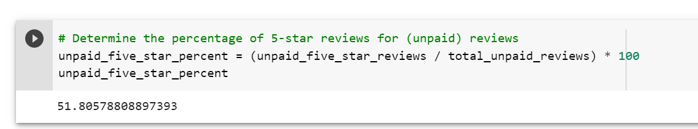

# Amazon_Vine_Analysis

### Overview of the Analysis
The purpose of this project was to analyze Amazon reviews written by members of the paid Amazon Vine program and determine if there is any bias toward favorable reviews from Vine members in our dataset.

### Results
We performed our analysis on watch products. The following resources were used:

Dataset: https://s3.amazonaws.com/amazon-reviews-pds/tsv/amazon_reviews_us_Watches_v1_00.tsv.gz

Applications:
- PostgresSQL
- pgAdmin 4
- AWS
- Google Colab

Results: Using bulleted lists and images of DataFrames as support, address the following questions:

How many Vine reviews and non-Vine reviews were there?

 - There were a total of 47 Vine reviews.

- There were a total of 8362 non-Vine reviews.

How many Vine and non-Vine reviews were 5 stars? 

- There were 15 5-star Vine reviews.

- There were 4332 5-star non-Vine reviews.

What percentage of Vine reviews were 5 stars? What percentage of non-Vine reviews were 5 stars?

- 32% of the Vine reviews were 5-stars

- 52% of the non-Vine reviews were 5-stars.

### Summary
There does not appear to be any positivity bias for reviews in the Vine program. 52% of the 5-star reviews came from non-Vine reviewers as compared to 32% from Vine reviewers. We also observe that the non-Vine members provided an overwhelming higher number of reviews in general at 8362 than their Vine member counterpart at 47 reviews. The Vine membership does not seem to add any benefit to for SellBy.

An additional analysis that might be helpful in supporting this statement is to look at the average ratings and the quality of reviews.